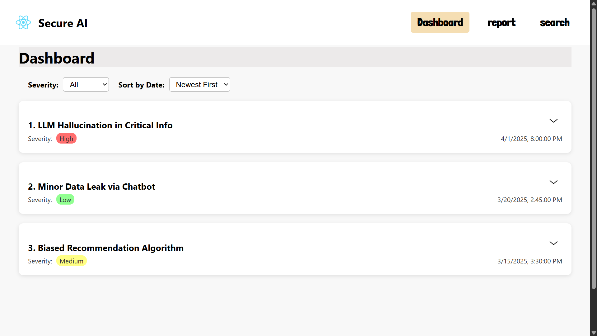
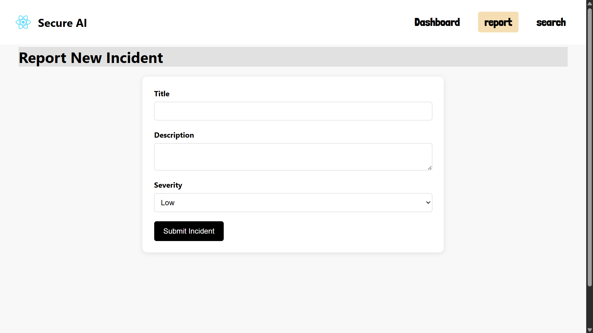
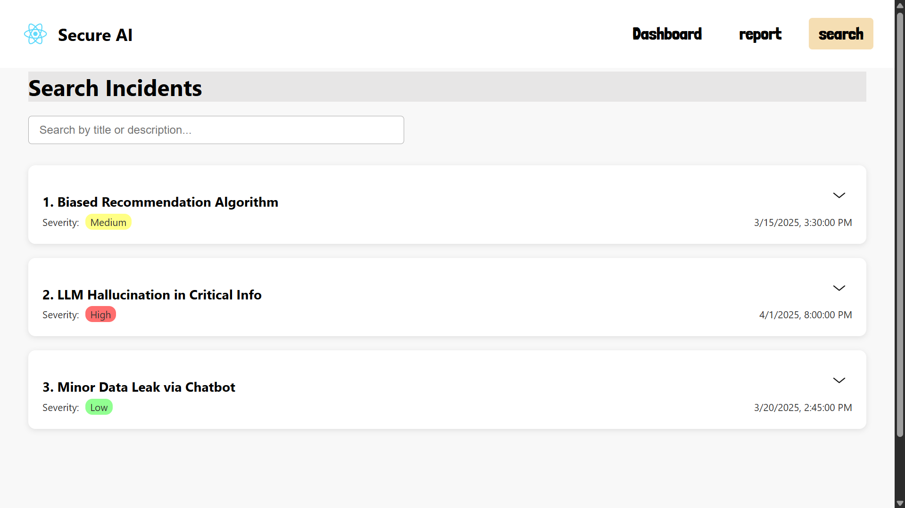

# AI Safety Incident Dashboard

This is a dashboard that helps track AI safety incidents. It provides insights, trends, and statistics related to AI safety incidents across various industries.

## Table of Contents
- [Installation](#installation)
- [Usage](#usage)
- [Tech Stack](#tech-stack)
- [Design Decisions](#design-decisions)

## Installation

To run this project locally, follow these steps:

### 1. Clone the Repository
Clone the project to your local machine using the following command:

```bash
git clone https://github.com/Ayush8418/ai-safety-incident-dashboard.git
cd ai-safety-incident-dashboard
npm install
npm start
```
# Tech Stack
-frontend: html, css, javascript.
-framework: React.js
-Version Control: Git, GitHub

Design Decisions
State Management: For managing global state, we decided to use React’s useState and useEffect hooks, as this provides a clean and efficient way to manage state in a React project.

UI Components: We made sure to keep the UI minimal and intuitive, ensuring that users can easily track AI safety incidents. The dashboard layout is designed to provide quick insights at a glance.

## Website Preview
dashboard 
 
report page
 
 search page
 

